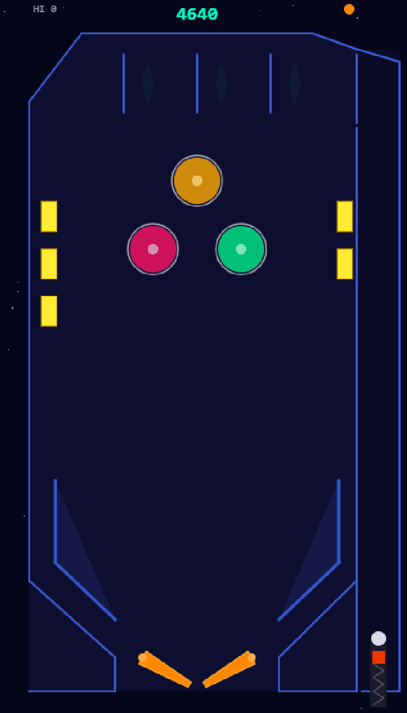

# 🚀 Space Pinball

<div align="center">



*A pixel art tribute to Microsoft 3D Pinball: Space Cadet — built with HTML5 Canvas and vanilla JavaScript.*

</div>

Remember those late nights racking up points on Space Cadet? This is our love letter to that classic, reimagined as a pixel art browser game. No installs, no dependencies, no nonsense — just pinball.

---

## 🕹️ Play It

**Online:** Deploy to GitHub Pages and play instantly —  
`https://<your-username>.github.io/pinball/`

**Locally:**

```bash
# Any static server works — here's the quickest
python -m http.server
# Then open http://localhost:8000
```

---

## 🎮 Controls

| Action | Keys |
|--------|------|
| Left flipper | `Z` · `←` · `Left Shift` |
| Right flipper | `/` · `→` · `Right Shift` |
| Plunger | `Space` · `↓` — hold to charge, release to launch |
| Start game | `Space` · `Enter` |

---

## ✨ Features

- 🔄 **120Hz fixed-timestep physics** — smooth, deterministic simulation decoupled from frame rate
- 💥 **Circle-segment collision detection** — accurate ball-vs-wall and ball-vs-flipper response
- 🌌 **Space-themed pixel art aesthetic** — native 400×700 canvas with `pixelated` rendering
- 🏓 **Responsive flippers** with velocity transfer proportional to contact distance from pivot
- 🎯 **3 bumpers, 5 drop targets, 3 rollover lanes, slingshots** — full pinball table layout
- ✖️ **Score multiplier system** — rack it up to 5× for massive points
- ❤️ **3 lives per game** — classic arcade pressure
- 🏆 **High score persistence** via `localStorage` — your best run is always remembered
- ✨ **Twinkling star field background** — because space
- 📦 **Zero dependencies** — pure vanilla JS, no build tools, no frameworks

---

## 📐 Architecture

| Module | Purpose |
|--------|---------|
| `src/constants.js` | All tuning parameters — physics, colors, dimensions, scoring |
| `src/input.js` | Keyboard state tracking (held, just-pressed, just-released) |
| `src/entities.js` | Entity classes: Ball, Flipper, Bumper, Wall, Target, Rollover, Plunger |
| `src/table.js` | Table layout factory — positions and instantiates all entities |
| `src/physics.js` | 120Hz fixed-timestep engine — gravity, collision detection & response |
| `src/renderer.js` | Canvas drawing — visuals, state overlays, HUD |
| `src/scoring.js` | Score, lives, multiplier logic, localStorage high score |
| `src/game.js` | Game loop + state machine orchestrator |

---

## 🛠️ Tech Stack

- **HTML5 Canvas** — all rendering, no DOM manipulation for game elements
- **ES Modules** — clean `import`/`export`, loaded via `<script type="module">`
- **Vanilla JavaScript** — no frameworks, no libraries, no transpilation
- **No build tools** — open `index.html` and play

---

## 🚀 Running Locally

```bash
# Clone the repo
git clone https://github.com/<your-username>/pinball.git
cd pinball

# Serve it (pick your favorite)
python -m http.server          # Python 3
npx serve .                    # Node.js
php -S localhost:8000           # PHP

# Open http://localhost:8000 in your browser
```

> **Note:** Opening `index.html` directly via `file://` won't work because ES modules require a server.

---

## 🌐 Deploying to GitHub Pages

1. Push your code to the `main` branch
2. Go to **Settings → Pages** in your GitHub repo
3. Set source to **Deploy from a branch** → `main` → `/ (root)`
4. Your game will be live at `https://<your-username>.github.io/pinball/`

---

## 📄 License

[MIT](LICENSE) — do whatever you want with it. Go build something fun.
